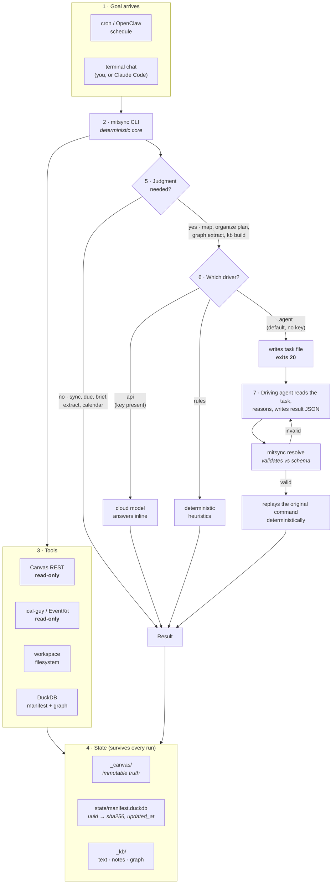

# mitsync

An agent that keeps MIT course material organised: it mirrors Canvas, files
documents into the student's own folder scheme, reads Apple Calendar, and
maintains a knowledge base a *downstream* agent can use to help with
coursework.

The deliberate design choice, and the one everything else follows from:

> **Deterministic Python does the I/O. A model does only the judgment.**

Fetching, hashing, diffing, moving and extracting are code — they must be
idempotent, replayable and free. Deciding *"is this a lecture or a
recitation?"* is judgment — that needs a model. Keeping them apart is what
makes a scheduled run cheap and a failure debuggable.

---

## The agentic loop



**Why this is an agent and not a prompt.** It pursues a standing goal across
scheduled runs it does not control; it remembers what it already did, in a
manifest that makes a second sync download zero bytes; it chooses among tools;
and when it needs judgment it can either call a model or **hand the reasoning
out and resume where it left off**. Step 7 is the unusual part — see below.

---

## The two hosts

The same commands, the same on-disk results, two ways to drive them.

| | **OpenClaw** (autonomous) | **Claude Code / any agent** (interactive) |
|---|---|---|
| Who starts it | built-in cron, unattended | you, in a terminal |
| Judgment | `--driver api`, a cloud model | `--driver agent` — **no API key needed** |
| On judgment | model answers inline, run continues | CLI **exits 20** with a task file; the agent resolves it |
| Needs | Node ≥ 24.16, an API key | nothing but `uv` |
| Entry point | `skills/*/SKILL.md` | `CLAUDE.md` |

Neither is privileged. OpenClaw is an optional scheduler, not a dependency —
`mitsync` is a standalone CLI, and every capability is reachable with zero
credentials.

### Exit code 20, the handoff protocol

This is what lets a model-free CLI still do model-shaped work:

```
$ mitsync organize plan --include-existing --driver agent
Judgment needed: organize_plan
Task file: state/tasks/organize_plan-20260920T141714Z-afcb3cec.json
$ echo $?
20
```

The task file is self-contained: the payload, a JSON schema the answer must
satisfy, and **the verbatim current text of `config/naming.md`** as the rules.
The driving agent reasons, writes a result, and calls
`mitsync resolve <task> --result <result.json>`, which validates against the
schema and replays the original command deterministically. An invalid result
is rejected with the failing JSON path, not forced through.

Real behaviour, not illustrative: on 127 files a resolve that placed 4 of them
**explicitly rejected the other 123 and moved nothing.** Planning and applying
are separate steps.

---

## Tools the agent has

Four external tools, two of them locked read-only:

| Tool | Access | Enforcement |
|---|---|---|
| **Canvas REST** (`canvas.mit.edu/api/v1`) | **read-only** | `CanvasClient._request` refuses any method outside `{GET, HEAD}` with `CanvasWriteRefused`; an AST test scans every module for write calls |
| **Apple Calendar** via `ical-guy` (EventKit) | **read-only** | no write path exists in the code; OpenClaw's exec allowlist pins the argv |
| **Workspace filesystem** | read/write, scoped | confined to the workspace; `_agent/`, `_kb/` and `nandatown` are pruned from every walk |
| **DuckDB** | read/write | `state/manifest.duckdb` (sync state), `state/graph.duckdb` (a *rebuildable* projection) |

Canvas is read-only because it holds graded work. Calendar is read-only
because nothing here should ever move a class.

### Commands

Always trust `mitsync --help` over this table.

| Command | Judgment? | What it does |
|---|---|---|
| `sync` | no | Mirror Canvas into `_canvas/`; incremental via the manifest |
| `map` | **yes** | Match Canvas courses to your folder names → `config/courses.yml` |
| `organize plan` / `apply` / `undo` | **plan only** | File material into your folders; apply writes an undo log |
| `calendar` | no | Read Apple Calendar events |
| `due` | no | Collect deadlines → `_kb/due.json` |
| `brief` | no | Daily briefing → `_kb/briefings/<date>.md` |
| `extract` | no | Documents → text under `_kb/text/` |
| `graph extract` | **yes** | Concepts and relations → `_kb/graph/*.jsonl` |
| `graph rebuild` / `query` | no | Rebuild the DuckDB projection; run SQL or a canned query |
| `kb build` | **yes** | Indexes, notes, `_kb/manifest.json`, `_kb/AGENTS.md` |
| `resolve` | — | Validate an agent's result and replay the command |
| `doctor` | no | What is configured, what is missing, how to fix it |

**Exactly four commands take `--driver` / `--resolve`** and can exit 20:
`map`, `organize plan`, `graph extract`, `kb build`. Everything else is pure
I/O and never produces a pending task.

### Skills (the OpenClaw surface)

Discovered from `<workspace>/skills`. Each is a `SKILL.md` whose YAML
frontmatter declares what it needs (`bins`, `env`, `os`); the prose carries
only what the CLI cannot express — the approval protocol, which errors are
expected, when to refuse to answer.

| Skill | Wraps | The judgment it adds |
|---|---|---|
| `mit-canvas-sync` | `sync` | which errors are expected vs. worth escalating |
| `mit-organize` | `organize plan/apply/undo` | the approval protocol — a vague "sounds good" is **not** approval |
| `mit-briefing` | `due`, `brief`, `calendar` | staleness; *calendar unavailable is a correct answer, an invented 10am lecture is not* |
| `mit-kb` | `extract`, `graph`, `kb build` | the canned-query catalogue and the read-only SQL constraint |

---

## Configuration

Four files, all prose or YAML, none of it in Python:

| File | What you tune |
|---|---|
| `config/naming.md` | **Your filing rules, in prose.** Injected verbatim into every filing prompt — change behaviour by editing English, never by patching code |
| `config/courses.yml` | Canvas id → your folder name, course number, aliases |
| `config/settings.yml` | Canvas/LLM/calendar/graph settings, ignore globs |
| `config/ontology.yml` | Graph node and edge types (v0 placeholder — replace, then `graph rebuild`) |

Secrets live in `_agent/.env` or `~/.openclaw/.env`, never in the repo.

---

## Layout

```
~/Desktop/MIT/courses/          <- the workspace
  Machine Learning/             <- your folders, your names, never touched
  Optimization/                 <-   without an approved plan
  ...
  _canvas/<course>/             <- verbatim Canvas mirror; source of truth,
                                <-   safe to wipe and re-sync, never edited
  _kb/                          <- for a downstream agent
    AGENTS.md                   <-   start here when helping with coursework
    manifest.json  INDEX.md  due.json
    text/  courses/  briefings/  graph/
  _agent/                       <- this repo
    config/  skills/  docs/  openclaw/  state/  tests/
    mitsync/
      cli.py                  <- the only place an error becomes an exit code
      core/                   <- errors, logging, clock, paths, env, config
      canvas/                 <- client, sync, manifest   (read-only, HTTP)
      filing/                 <- course_map, organize
      schedule/               <- calendar, deadlines      (read-only, EventKit)
      knowledge/              <- extract, graph, kb
      llm/                    <- the only package that may import a model SDK
```

`_canvas/` is never emptied and files are only ever copied or hardlinked
*out* of it, so a mis-file can always be undone.

The package layering is one-directional: `core` imports nothing above it, the
four capability packages import `core` and `llm`, and only `cli` imports all of
them. Each `__init__.py` states the constraints its modules must keep — read
those first.

---

## Quickstart

```bash
uv sync
cp .env.example .env          # add CANVAS_TOKEN
uv run mitsync doctor         # what works, what is missing

uv run mitsync sync           # mirror Canvas
uv run mitsync extract        # documents -> text
uv run mitsync kb build       # indexes, notes, _kb/AGENTS.md
uv run mitsync due && uv run mitsync brief
```

No API key is required for any of it. Commands that need judgment will exit 20
and hand you a task file.

## Further reading

| | |
|---|---|
| `CLAUDE.md` | **How an agent drives this repo** — the driver contract and the guardrails. Read before running anything that moves files |
| `AGENTS.md` | House code style |
| `docs/PRD.md` | Problem, goals, non-goals, requirements |
| `docs/ENGINEERING_PLAN.md` | Architecture and layering |
| `docs/API_NOTES.md` | Canvas + EventKit findings, with unverified items marked as such |
| `docs/RUNBOOK.md` | Setup, TCC grants, cron, failure modes, recovery |
| `docs/ADR/` | Why: dual execution model, DuckDB-as-projection, read-only EventKit |
| `mitsync/core/errors.py` | The error taxonomy — the source, not a copy of it |
